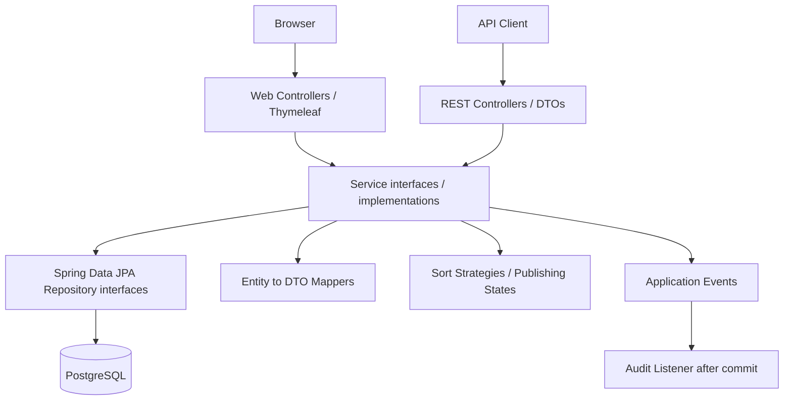
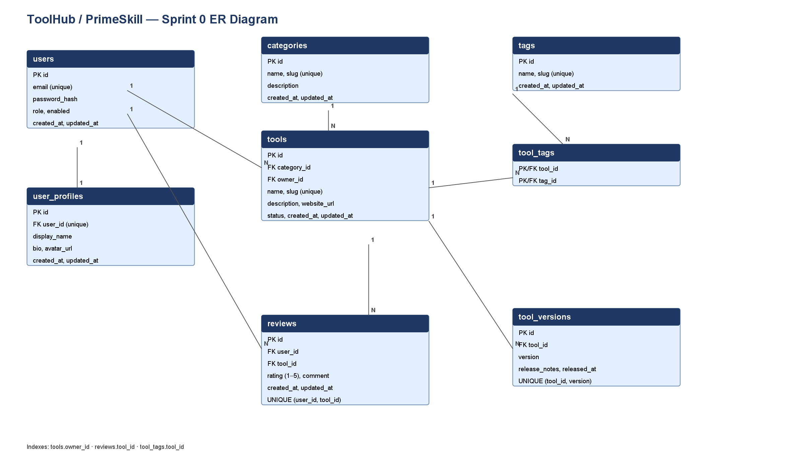

# PrimeSkill

PrimeSkill (ชื่อแอปพลิเคชันภายใน ToolHub) เป็นเว็บสำหรับค้นหาและแบ่งปันเครื่องมือซอฟต์แวร์
ผู้ใช้ค้นหาตามหมวดหมู่/แท็ก เรียงลำดับ และดูคะแนนจากรีวิวจริงได้
เจ้าของจัดการเครื่องมือและเวอร์ชันในสถานะร่าง ก่อนส่งให้ผู้ดูแลอนุมัติเผยแพร่
ผู้ใช้เขียนและจัดการรีวิวของตนเอง โดยระบบตรวจสิทธิ์และสถานะของเครื่องมือ
ระบบพัฒนาด้วย Spring Boot/Thymeleaf และเก็บข้อมูลบน PostgreSQL

## Deployment URL

- **เว็บใช้งานจริง:** [PrimeSkill Live Demo](https://primeskill-zeta.vercel.app/)
- [Browse tools](https://primeskill-zeta.vercel.app/tools) · [Register](https://primeskill-zeta.vercel.app/register) · [Sign in](https://primeskill-zeta.vercel.app/login)
- [Swagger UI](https://primeskill-zeta.vercel.app/swagger-ui/index.html) · [OpenAPI JSON](https://primeskill-zeta.vercel.app/v3/api-docs)

Production ใช้ Vercel และ PostgreSQL บน Supabase; ณ วันที่ตรวจ 10 ตุลาคม 2026 Production ติดตาม branch `develop` ที่ SHA `4678e0047184de7100579041c9cdfacfe228c688` การรวม `main` ไม่เปลี่ยน branch deploy เอง ดู [สถานะและหลักฐาน](doc/SESSION_HANDOFF.md) และตรวจ dashboard อีกครั้งก่อนนำเสนอ

## สมาชิกกลุ่ม / Team

| No. | Name | Student ID | Section | Branch | Responsibility |
| --- | --- | --- | --- | --- | --- |
| 1  ณัฐกรณ์ อินธิสาร | 673380268-2 | 2 | nattakorn_6733802682_02 | Role A: บัญชีผู้ใช้, Login/Logout, Profile, Session, CSRF และสิทธิ์ USER/ADMIN |
| 2  นายณัชพล เพ็งพล | 673380267-4 | 2 | natchapol_6733802674_02 | Role B: สร้าง/ดู/แก้ไข/ลบเครื่องมือ, Validation และสิทธิ์เจ้าของเครื่องมือ |
| 3  นายศุภกร กรมรินทร์ | 673380061-4 | 2 | supakron_673380061-4_02 | Role C: Browse/Search, ตัวกรองหมวดหมู่และแท็ก, Sorting, Pagination และจัดการแท็ก |
| 4  นายณภัทร อรัญพูล | 673380036-3 | 2 | naphat_67338800363_02 | Role D: สร้าง/แก้ไข/ลบรีวิว, รีวิวของฉัน, คะแนนเฉลี่ยและจำนวนรีวิว |
| 5  นายธนินธร อันทรบุตร | 673380043-6 | 2 | thaninton_673380043-6_02 | Role E: เวอร์ชันและการเผยแพร่, Admin moderation, Integration, CI, Docker, Supabase และ Deployment |

ชื่อ branch และหน้าที่คงตามข้อมูลทีมเดิม ต้องตรวจชื่อ branch จริงและรูปแบบตามใบงานก่อนส่ง โดยเฉพาะรหัสใน branch ของ Role D; ตารางนี้ไม่ได้รับรองจำนวน commit รายบุคคล

## Tech Stack

- **Backend:** Java 17, Spring Boot 4.1.1, Maven, Spring Web MVC
- **Web UI:** Thymeleaf, HTML/CSS/JavaScript
- **Persistence:** Spring Data JPA/Hibernate, PostgreSQL; Supabase สำหรับฐานจริง, PostgreSQL 17 ใน local Compose
- **Security:** Spring Security, session authentication, CSRF; Spring Session JDBC ใน profile `vercel`
- **API docs:** springdoc OpenAPI 3.1.1 / Swagger UI
- **Testing:** JUnit, Mockito, Spring Boot Test/MockMvc, H2 แยกสำหรับ tests และ PostgreSQL integration ผ่าน Failsafe
- **Delivery:** Git/GitHub, GitHub Actions, Docker/Compose, Vercel

เวอร์ชัน dependencies อ้างอิง [pom.xml](code/pom.xml)

## System Architecture



Controllers รับ HTTP/validation และเรียก Service; Services จัดการ business rules/transactions; Repositories จัดการ persistence; DTO/Mapper แยก Entity ออกจาก response API การตรวจสิทธิ์ทำที่ขอบเขต security และ business operations

- **Anonymous:** ดูเครื่องมือที่เผยแพร่, ค้นหา และสมัครสมาชิก
- **USER:** จัดการ profile/รีวิวของตัวเอง และเครื่องมือที่เป็นเจ้าของ
- **ADMIN:** จัดการหมวดหมู่/แท็กและอนุมัติหรือปฏิเสธเครื่องมือ ตามกฎของแต่ละ operation
- “Owner” เป็นความสัมพันธ์เจ้าของเครื่องมือ ไม่ใช่ role แยกจาก USER
- Lifecycle: `DRAFT → PENDING → PUBLISHED → DEPRECATED`; reject กลับ DRAFT, restore กลับ DRAFT
- Versions และ tag assignment แก้ได้เฉพาะ DRAFT ตามสิทธิ์ที่กำหนด

ดู [SOLID analysis](doc/solid-analysis.md), [Design Patterns](doc/design-patterns.md) และ [Class Diagrams](doc/diagrams/design-patterns.md) มี Behavioral Patterns: Strategy, State, Observer พร้อมอธิบายข้อจำกัดของโค้ดปัจจุบัน

## Database Design (ER Diagram)



มี 8 ตารางธุรกิจ: `users`, `user_profiles`, `categories`, `tools`, `tags`, `tool_tags`, `reviews`, `tool_versions`

- One-to-One: user กับ user profile (unique user FK)
- One-to-Many: category กับ tools, tool กับ versions/reviews, user กับ reviews
- Many-to-Many: tools กับ tags ผ่าน `tool_tags`
- Foreign keys, unique constraints และ indexes อยู่ใน [schema.sql](code/src/main/resources/schema.sql)
- [Data Dictionary](doc/data-dictionary.md) · [Seed data](code/src/main/resources/data.sql)
- [Migration runbook](doc/migration-rollout-runbook.md) · [Release SQL manifest](doc/sql/migration-release-manifest.json)

Hibernate ใช้ `ddl-auto=validate` ไม่สร้าง DDL อัตโนมัติ Default local profile รัน SQL initialization; production `vercel` ปิด SQL initialization และใช้ schema ที่จัดเตรียมแล้ว JDBC session tables เป็น infrastructure เพิ่มจาก 8 ตารางธุรกิจ ห้าม replay migration/seed บนฐานจริงโดยไม่มีการตรวจสถานะและแผน rollout

## Installation & Setup

### Prerequisites

- Git, JDK 17 และ Maven; Docker Desktop/Compose สำหรับวิธี Docker
- PostgreSQL สำหรับรันตรงหรือ PostgreSQL integration tests
- Clone repository: `git clone https://github.com/aarktik/PrimeSkill.git` แล้ว `cd PrimeSkill`

### วิธีแนะนำสำหรับ local: Docker Compose

จาก repository root:

```powershell
Copy-Item .env.example .env
# แก้ POSTGRES_PASSWORD ใน .env เป็นรหัส local ของคุณก่อนรัน

docker compose up --build -d
docker compose logs -f app
```

Compose สร้าง PostgreSQL แยกและ app เปิด port 8080 ข้อมูล local อยู่ใน named volume ไม่จำเป็นต้องใช้ Supabase credentials ไฟล์ `.env` ใช้เก็บค่าท้องถิ่นและห้าม commit

### รันตรงด้วย Maven และ PostgreSQL ของตนเอง

ตั้งค่าต่อไปนี้ใน PowerShell session หรือระบบจัดการ environment ของคุณ:

```powershell
$env:SUPABASE_DB_URL = 'jdbc:postgresql://localhost:5432/toolhub'
$env:SUPABASE_DB_USERNAME = 'toolhub'
# ตั้ง SUPABASE_DB_PASSWORD เป็นรหัสฐาน local ผ่านช่องทางส่วนตัว
$env:SESSION_COOKIE_SECURE = 'false'
```

ชื่อ environment มีคำว่า SUPABASE แต่รับ PostgreSQL JDBC connection ได้ทั่วไป ฐานที่ระบุควรเป็นฐาน local สำหรับพัฒนา เพราะ default profile มี SQL initialization ไม่ใส่ Supabase project HTTPS URL หรือ API key แทน JDBC URL

## How to Run

จาก repository root:

```powershell
mvn -f code/pom.xml spring-boot:run
```

Windows ที่มี JDK หลายรุ่น ตั้ง `JAVA17_HOME` เป็นโฟลเดอร์ JDK 17 แล้วใช้:

```powershell
./scripts/mvn-java17.ps1 -f code/pom.xml spring-boot:run
```

- เว็บ local: [http://localhost:8080](http://localhost:8080)
- Swagger local: [http://localhost:8080/swagger-ui/index.html](http://localhost:8080/swagger-ui/index.html)
- `/dashboard/tools`: เครื่องมือของผู้ใช้ที่ login
- `/dashboard/tools/{id}/versions`: เวอร์ชันของเครื่องมือ
- `/my/reviews`: รีวิวของฉัน
- `/admin/tools`: คิวอนุมัติสำหรับ admin

สมัครผ่าน `/register`; บัญชีใหม่เป็น USER การให้ ADMIN ต้องทำโดยผู้ดูแลที่ได้รับอนุญาต ไม่เผยรหัสบัญชีทดสอบใน README

Build และรัน JAR หลังตั้ง environment:

```powershell
mvn -f code/pom.xml -DskipTests package
java -jar code/target/toolhub-0.0.1-SNAPSHOT.jar
```

คำสั่ง package ด้านบนข้าม tests; ใช้คำสั่งในหัวข้อถัดไปเพื่อทดสอบ หยุด Compose โดยเก็บข้อมูลไว้: `docker compose down`

## API Documentation

[Swagger UI](https://primeskill-zeta.vercel.app/swagger-ui/index.html) แสดง endpoints, request/response schemas และ status codes; [OpenAPI JSON](https://primeskill-zeta.vercel.app/v3/api-docs) เป็น contract ที่ generated จากโปรแกรม

- Base path: `/api/v1`
- Resources: tools, versions, reviews, categories, tags, users/profile และ authentication
- Search: `GET /api/v1/tools` รองรับ q/category/tags/sort/page/size ตาม OpenAPI
- Published tool detail: `GET /api/v1/tools/{idOrSlug}`
- Tool versions: `/api/v1/tools/{toolId}/versions`
- Tool reviews: `/api/v1/tools/{toolId}/reviews`
- Admin reference data: `/api/v1/admin/categories`, `/api/v1/admin/tags`

Production Swagger เปิดอ่านแต่ปิด Try it out (`supportedSubmitMethods=[]`) API writes ยังต้องมี session, CSRF token และสิทธิ์ที่ถูกต้อง ใช้ [คู่มือ session/CSRF](doc/role-e-local-runbook.md) สำหรับตัวอย่าง client จริง Endpoint ที่ไม่ทราบให้ดู generated specification แทนการเดาชื่อ

## How to Run Tests

จาก repository root:

```powershell
# Default automated suite; tests configure their own isolated database
mvn -B -f code/pom.xml verify

# Windows: enforce JDK 17
./scripts/mvn-java17.ps1 -B -f code/pom.xml verify

# Full PostgreSQL regression on a disposable local cluster
./scripts/test-postgres.ps1
```

PostgreSQL script ต้องมี PostgreSQL binaries และ Maven; ใช้ `-PostgresBin`/`-MavenCommand` หาก path ต่างจากค่าที่รองรับ Script สร้าง cluster ใต้ `code/target`, bind loopback port 15432, รัน profile `postgres-it` และหยุด cluster หลังจบ ไม่ใช้ Supabase credentials

```powershell
py -3 -m unittest scripts/test_vercel_configuration.py
node --test scripts/test-navigation-transition.cjs
```

รายงาน Maven: `code/target/surefire-reports/`, `code/target/failsafe-reports/` หลังรัน ดู [PostgreSQL instructions](doc/role-e-local-runbook.md#postgresql-regression-tests), [browser acceptance](doc/vercel-real-browser-acceptance.md) และ [CI evidence](doc/role-e-ci-evidence-2026-10-09.md)

ผลที่ตรวจล่าสุดสำหรับ runtime patch `2af3802` ก่อน merge #13: **387 Surefire + 349 Failsafe = 736 Java tests ผ่าน**, ไม่มี failures/errors/skips; เป็นผลของ SHA นั้น ไม่ใช่คำรับรองว่า future changes ผ่านอัตโนมัติ เอกสารชุดนี้ไม่เปลี่ยน Java/config และไม่อ้างว่า tests พิสูจน์ SOLID ทั้งระบบ

## Project Structure

```text
PrimeSkill/
├── code/
│   ├── pom.xml
│   └── src/
│       ├── main/java/com/example/toolhub/
│       │   ├── controller/api/       REST controllers
│       │   ├── controller/web/       MVC controllers
│       │   ├── service/impl/         Use cases and transactions
│       │   ├── service/search/       Sort strategies
│       │   ├── service/publishing/   Publishing states
│       │   ├── repository/           Spring Data JPA
│       │   ├── domain/               Entities and enums
│       │   ├── dto/                  Request/response contracts
│       │   ├── mapper/               Entity/DTO mapping
│       │   ├── event/                Review event and audit listener
│       │   └── config/, security/, exception/
│       ├── main/resources/           Templates, static files, SQL, configuration
│       └── test/                     Automated Java tests and fixtures
├── test/                             Cross-role PostgreSQL suites and instructions
├── doc/                              Design, evidence, handoff and runbooks
│   ├── diagrams/                     ER and Pattern class diagrams
│   └── slide/                        Presentation location
├── img/                              Multimedia location
├── scripts/                          Build/test/deployment helpers
├── .github/workflows/                CI workflows
├── Dockerfile                        Local container build
├── Dockerfile.vercel                 Vercel container build
├── docker-compose.yml                Local app + PostgreSQL
└── vercel.json                       Vercel service configuration
```

## Git Workflow & Delivery

งานส่วนตัวใช้ branch ตามรูปแบบใบงาน `ชื่อ_รหัสนักศึกษา_section` รวมผ่าน PR เข้า `develop` และส่งมอบผ่าน PR `develop → main` ให้สมาชิกทีมอย่างน้อยหนึ่งคนรีวิว SHA สุดท้าย ทุกคนใช้บัญชีและ commit identity ของตนเอง; ตรวจ meaningful commits อย่างน้อย 15 ครั้งต่อคนตามใบงาน

CI ผ่านและ reviewer อนุมัติเป็นหลักฐานคนละส่วน ต้องตรวจทั้งคู่ก่อน merge รุ่นส่งมอบ การรวม main ไม่เปลี่ยน Vercel Production Branch จาก develop โดยอัตโนมัติ ตรวจ branch/source SHA/domain ใน dashboard และ smoke check public URLs หลังเปลี่ยนการ deploy

## Submission Status / Known Gaps

README นี้อธิบายสิ่งที่มีจริงและวิธีใช้งาน ไม่ได้รับรองว่าใบงานครบ 100%:

- มี [SOLID analysis](doc/solid-analysis.md) ครบหัวข้อ S/O/L/I/D พร้อมบรรทัดและข้อจำกัด; ยังมี OCP/SRP/DIP ที่ต้องปรับ และ LSP/ISP ที่ยังไม่ได้พิสูจน์ครบทุกสัญญา
- มี [Patterns table](doc/design-patterns.md), Behavioral 3 แบบ และ [Class Diagrams](doc/diagrams/design-patterns.md)
- ยังต้องจัดทำ Use Case + Description, Domain Model, Sequence อย่างน้อย 3 scenarios, Activity, Component, Deployment และ State Diagram ให้ครบตามใบงาน
- ยังต้องจัดทำสไลด์ใน `doc/slide/` และตรวจ Data Dictionary ให้ครบคอลัมน์/ความสัมพันธ์ที่ใบงานคาดหวัง
- ตรวจชื่อ branch/commit count ทุกคน และ final PR review/main merge แยกจากความพร้อมของเว็บ

ดู [Session Handoff](doc/SESSION_HANDOFF.md) สำหรับรายการงานและหลักฐานก่อนหน้า
