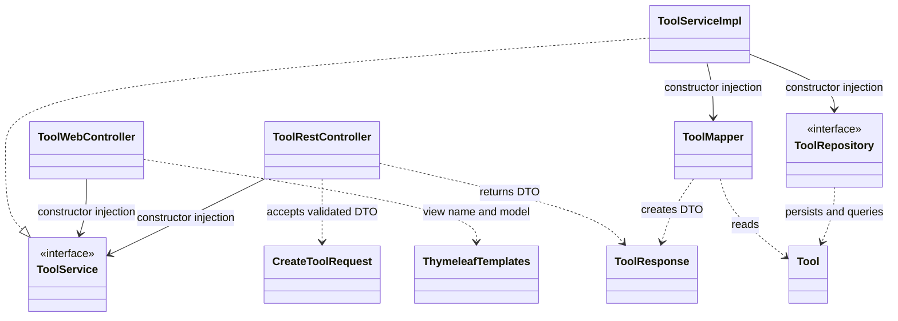
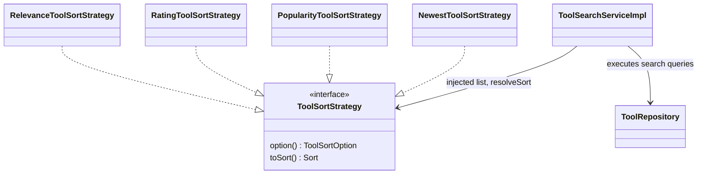
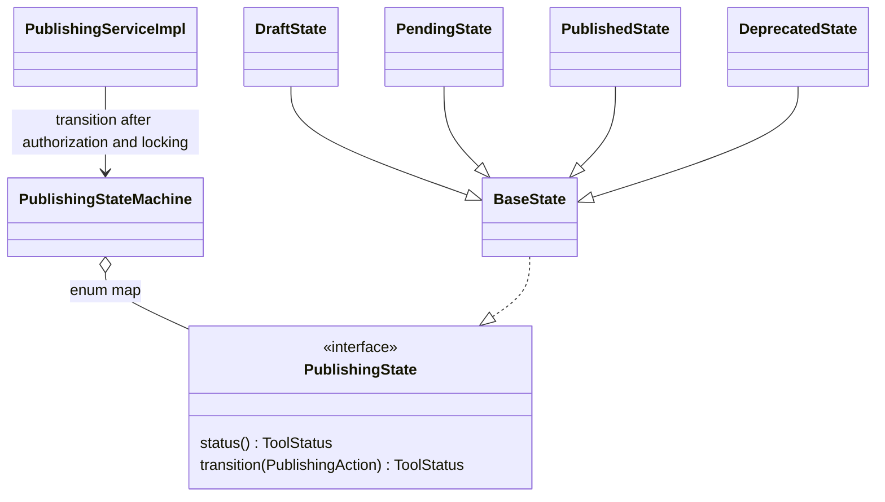
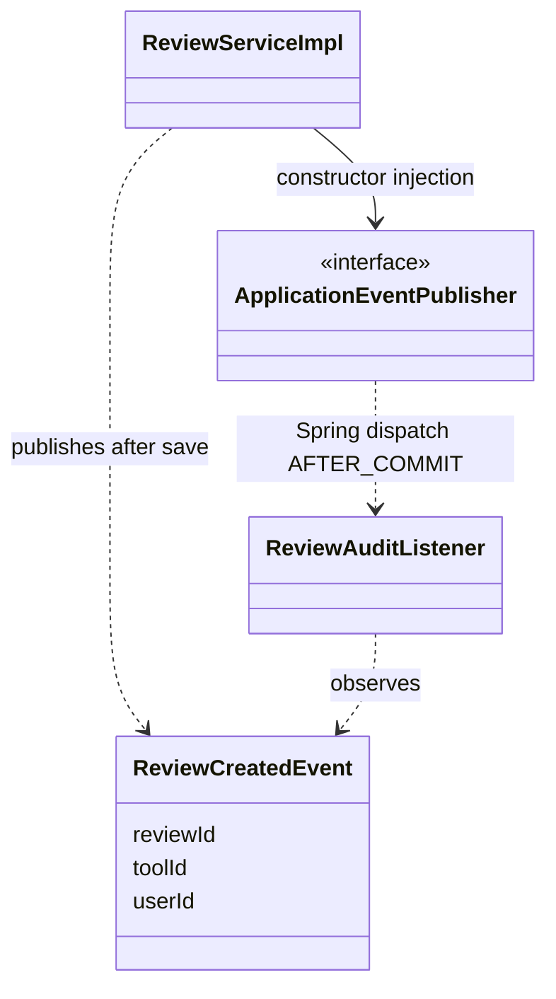

# PrimeSkill — Class diagrams

อ้างอิง develop SHA `4678e0047184de7100579041c9cdfacfe228c688` แสดงคลาสที่เกี่ยวข้องกับ Patterns โดยละสมาชิกที่ไม่เกี่ยวข้องเพื่อให้อ่านง่าย Mermaid source ในไฟล์นี้ render ได้บน GitHub

## Layered MVC Repository Service DTO and DI

## Strategy

Rating/Relevance aggregate query ordering remains in Service/Repository; this diagram does not imply those queries are delegated to strategies.

## State

BaseState and concrete states are private nested classes of PublishingStateMachine. Valid transitions: DRAFT→PENDING (submit), PENDING→PUBLISHED (approve), PENDING→DRAFT (reject), PUBLISHED→DEPRECATED (deprecate), DEPRECATED→DRAFT (restore).

## Observer

Spring dispatch is shown as an explanatory dependency; ReviewServiceImpl never calls ReviewAuditListener directly.
