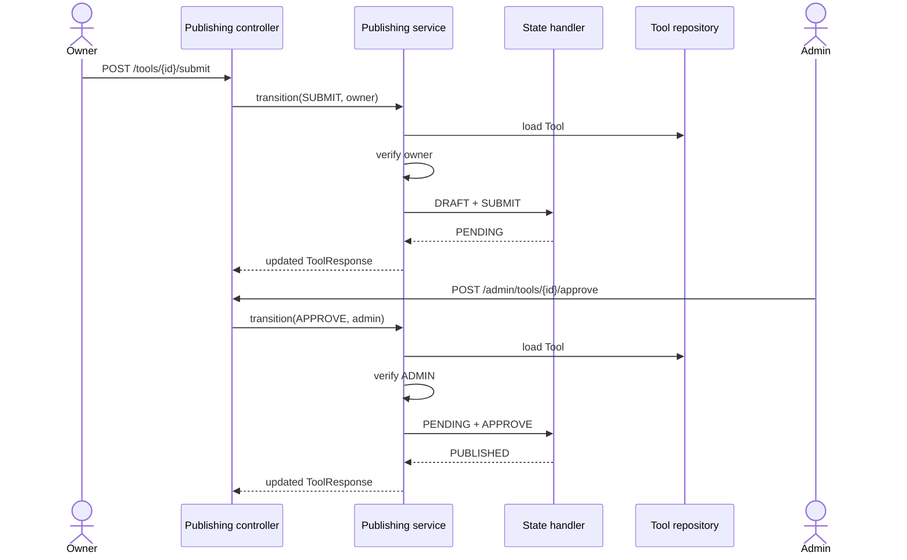
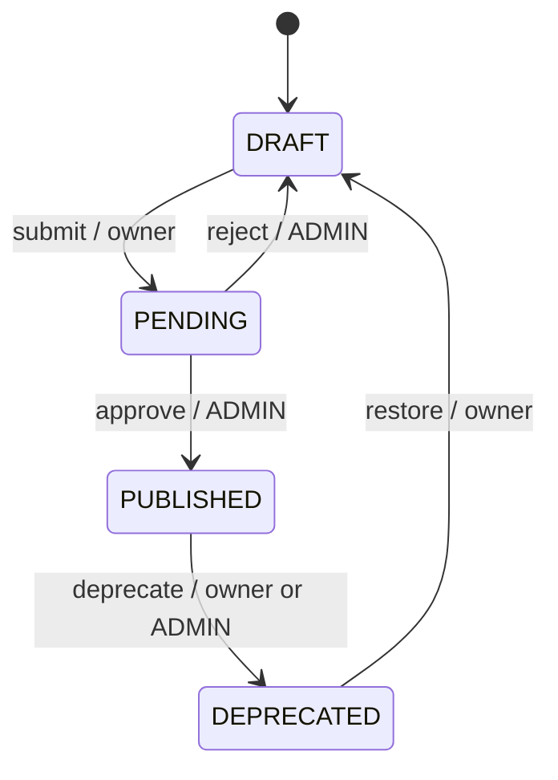
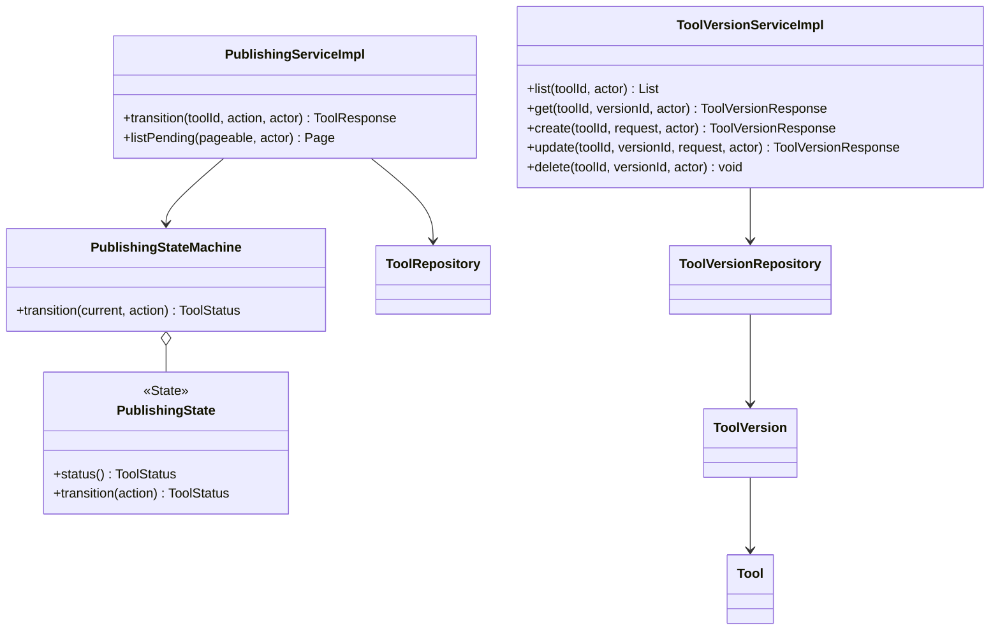
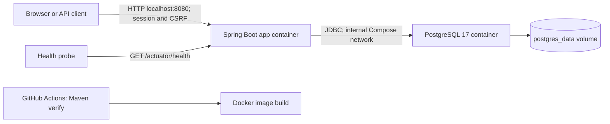

# Role E design and handoff

This describes the publishing and versioning code in this branch. It does not authorize changes to shared or production databases.

## Modules and responsibilities

- `PublishingState` and `PublishingStateMachine` implement the GoF **State** pattern. Each state handler owns its allowed actions. Unsupported actions throw `InvalidStateTransitionException`, mapped to HTTP 409 with `INVALID_STATE_TRANSITION`.
- `PublishingServiceImpl` loads the tool, checks the actor (owner or admin according to the action), asks the state machine for the next status, and updates the managed entity in a transaction. The controller does not set status.
- `ToolVersionServiceImpl` handles nested version reads and draft-only owner writes. It checks for duplicate version numbers before writing; the database unique constraint is the final guard against concurrent duplicates.
- Publishing transitions and version writes take a pessimistic lock on the same Tool row. This serializes a submit action with a concurrent draft version edit.
- `PublishingRestController` and `ToolVersionRestController` expose REST endpoints. `RoleEWebController` exposes the Thymeleaf pages and post/redirect/get mutations. All three use the same services.
- `RoleEWebExceptionHandler` gives scoped, safe web responses for 403, 404 and 409. The shared REST exception handler retains its JSON contract.

## Publishing sequence

## State transitions

## Role E class relationships

## Local deployment design

This diagram describes the prepared Compose configuration. Container startup and restart persistence have not been verified on this workstation because Docker is unavailable.

Production HTTPS, host, secrets and migration rollout remain team decisions. The workflow builds an image but does not publish or deploy it.

## Remaining integration points

1. The current `develop` branch provides session authentication and a `UserPrincipal` that implements `AuthenticatedUserPrincipal#getId()`, which Role E consumes through `CurrentActorProvider`. GET access to published version history is public; version mutations and publishing actions require authentication, admin actions require `ADMIN`, and state-changing web/API requests must carry CSRF tokens. `RoleEFlowIntegrationTest` verifies the real login-to-publish API flow with security filters and H2. Browser cookie behavior and PostgreSQL deployment verification remain pending.
2. The committed `schema.sql` has a `tool_versions.version VARCHAR(100)` and `release_notes`. The plan proposes `version_number VARCHAR(50)` plus optional manifest URL/type. A forward migration and data policy must be agreed before changing shared database schema. The `doc/sql/V7__align_existing_tool_catalog.sql` draft is not an approved migration.
3. The team must agree whether versions may be added to a published tool. This branch conservatively allows owner writes only while status is `DRAFT`.
4. The final shared UI owner should connect the pages to the common navbar/sidebar/alerts fragments when those assets exist. Role E pages use scoped `role-e.css` and direct links in the meantime.
5. Docker Compose and production deployment require runtime verification. Docker is not installed on this workstation. CI is configured to run Maven verify and build the container image; that updated workflow has not yet run on GitHub. PostgreSQL integration tests and the full login-to-review smoke flow remain pending.
